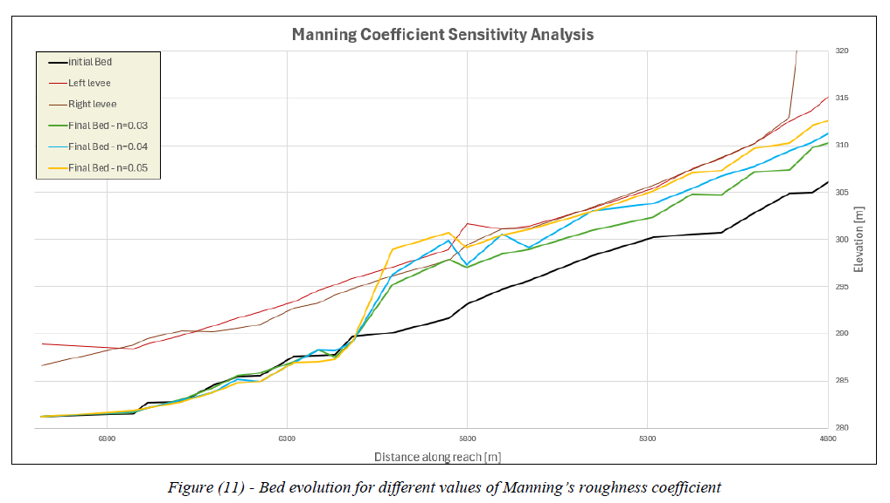
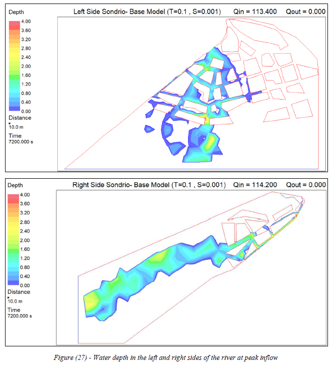
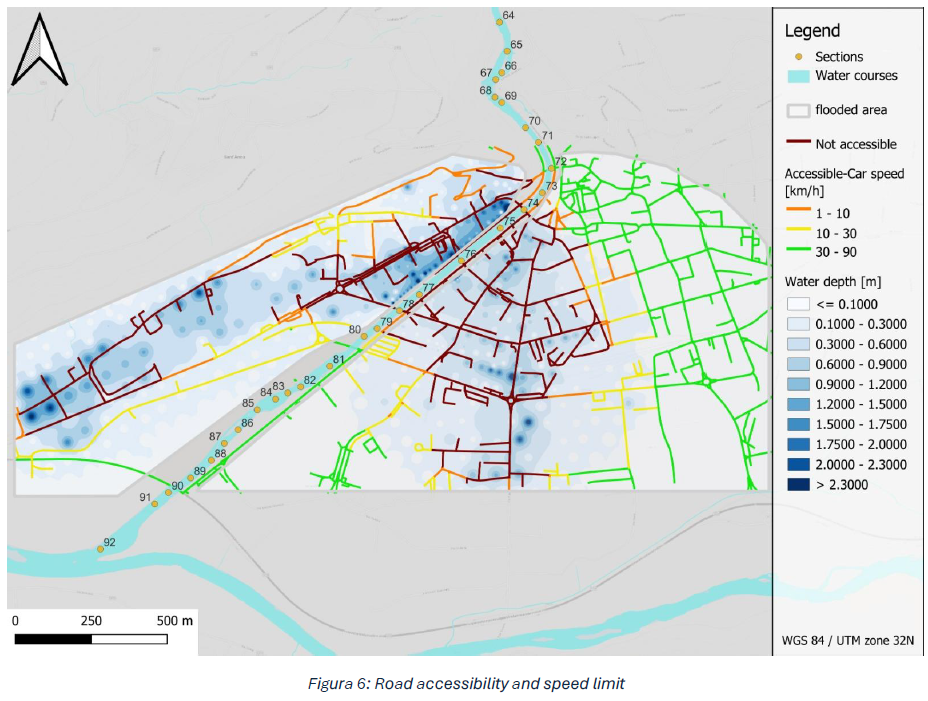
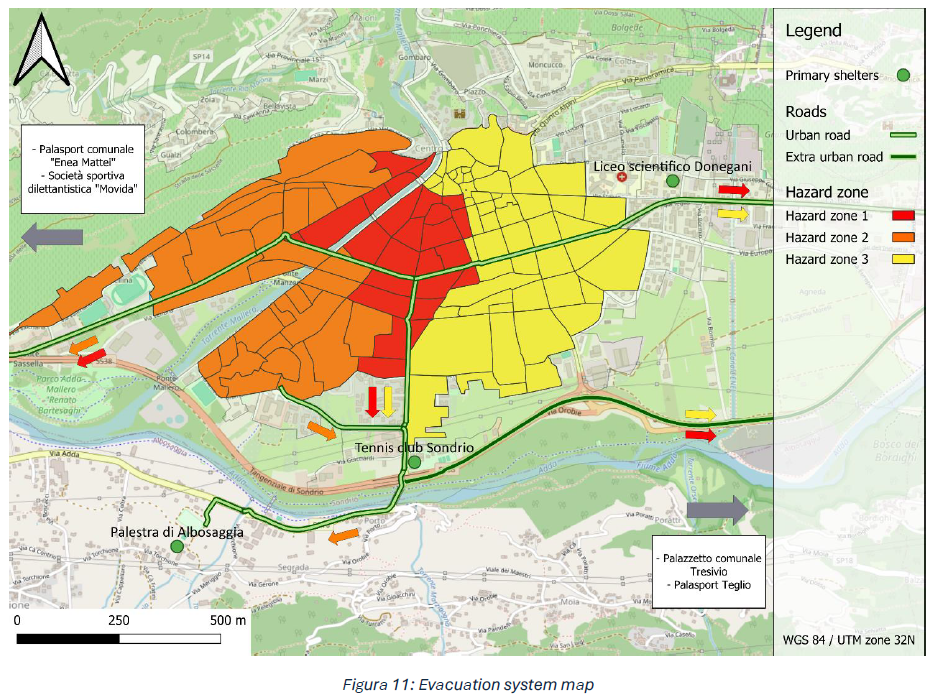

## Case Study
**Sondrio, Lombardy, Italy**; flood emergency plan for the scenario of a flood event on the Mallero River with T=100 years, 
with sediment transport from the Torreggio tributary

## Geological Hazard Assessment
- Reconstructed geological cross-section of a large landslide and assessed stability using SLOPE (LEM)
- Estimated debris flow volumes using D'Agostino formula, simulated runout with TopRunDF
- Estimated annual sediment yield of Mallero basin using EPM (Gavrilović), USLE, RUSLE, and MUSLE for single event
- Analysed rainfall intensity-duration thresholds for debris flow triggering 

## Hydraulic Modelling
- Built a 1D hydro-morphological model in BASEMENT
- Performed sensitivity analyses
- Converted overflow hydrographs to inflow boundary conditions using a lateral weir model
- Simulated urban inundation of Sondrio with River 2D
  
## Damage Assessment
- Estimated direct damage to residential buildings using Simple-INSYDE model
- Assessed population at risk
- Evaluated indirect damage to infrastructures and lifelines

## Emergency Plan
- Defined warning thresholds
- Estimated evacuation time
- Designed evacuation route system
- Structured response strategy across all phases

## Tools
SLOPE, TopRunDF, QGIS, Excel, BASEMENT, River 2D

## Preview

