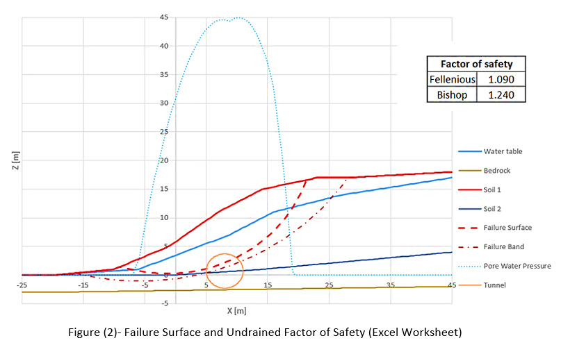
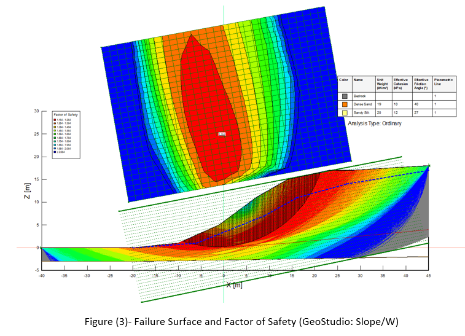
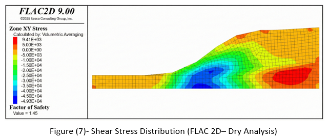
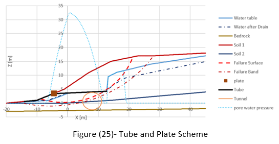
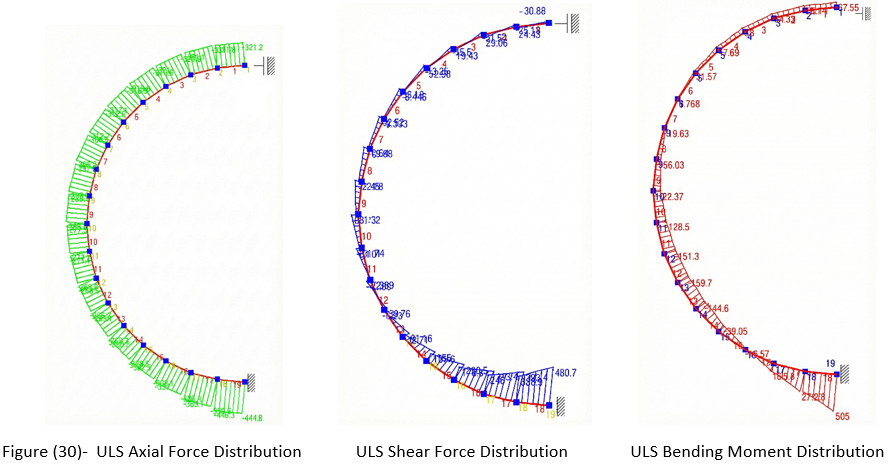

# Slope Stability Analysis and Tunnel Design

## Problem
- Circular tunnel (D = 6 m) to be built through a two-layer slope
- Slope unstable under drained conditions → landslide risk before construction
- Two objectives: **stabilize the slope** and **design the tunnel lining**

## Slope Stability Assessment
- Methods: Fellenius, Bishop, Janbu (method of slices)
- Implemented independently in **Excel**, cross-validated in **GeoStudio Slope/W**
- Numerical check via shear strength reduction in **FLAC 2D**
- Post-run verifications: stress distributions, strain increments, mechanical convergence

## Stabilization Design
Four interventions evaluated and designed:
- **Drainage** — tube and trench drains to reduce pore pressure along failure surface
- **Reinforced embankment** — geogrid-reinforced toe fill + crest excavation, verified for external and internal stability
- **Anchored plates** — pre-stressed, analyzed with both force-based and displacement-based approaches
- **Piles** — designed using soil-structure interaction abaci

→ Final design: tube drainage + anchored plates (best balance of effectiveness and constructability)

## Tunnel Lining Design
- Two material solutions compared: **RC** and **FRC**
- Checks at **ULS**: bending resistance, shear resistance
- Checks at **SLS**: stress limitation, crack width
- Cost comparison between RC and FRC solutions

## Tools
Excel · GeoStudio Slope/W · FLAC 2D · Eurocode 2 · Italian D.M. 17/01/2018

## Preview

### Slope Stability Analysis
  

### Stabilization Design

### Tunnel Lining Design

