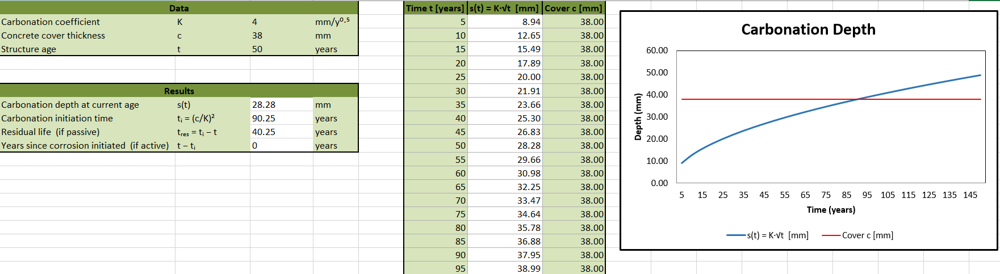

# Structure Durability: Monitoring and Control

## What I studied
- Electrochemical basis of corrosion: thermodynamics, kinetics, passivation
- Corrosion mechanisms: carbonation, chloride ingress, pitting, SCC
- Deterioration of RC structures: crack initiation, propagation, spalling
- Prevention: mix design, surface treatments, corrosion-resistant reinforcement
- Inspection and monitoring: half-cell potential, LPR, resistivity measurements
- Repair techniques: patch repair, electrochemical chloride extraction, cathodic protection

## Excel Implementation
- **Carbonation** — predicts when the carbonation front reaches the rebar: s = K·√t
- **Chloride ingress** — chloride concentration profile through cover using Fick's 2nd law
 
### Carbonation-induced Corrosion

### Chloride-induced Corrosion

