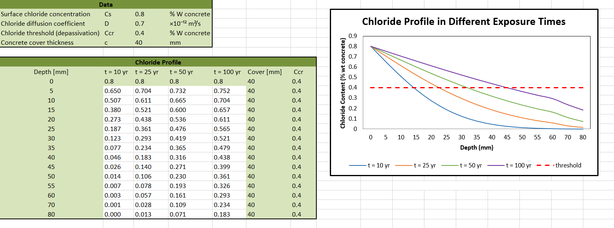

# Structure Durability: Monitoring and Control

Corrosion mechanisms in RC structures, service life prediction, 
inspection techniques, and repair strategies

## Topics
- Electrochemical basis of corrosion: thermodynamics, kinetics, passivation
- Corrosion mechanisms: carbonation, chloride ingress, pitting, SCC
- Prevention: mix design, surface treatments, corrosion-resistant reinforcement
- Inspection: half-cell potential, resistivity measurements
- Repair: patch repair, electrochemical chloride extraction, cathodic protection

## Implementation
Service life prediction models for carbonation and chloride-induced corrosion
 

