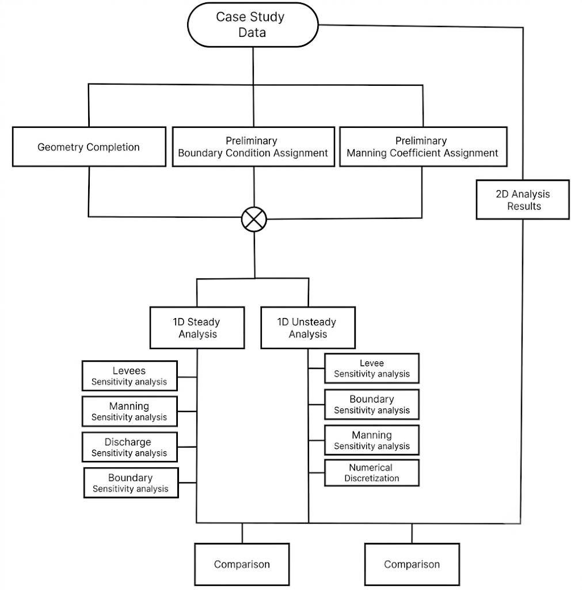
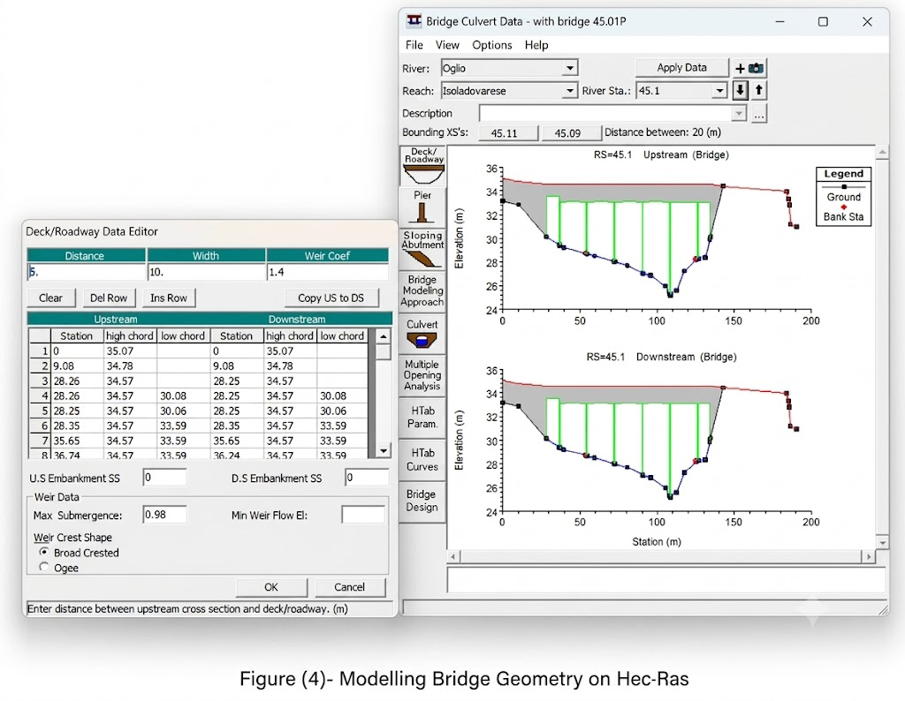
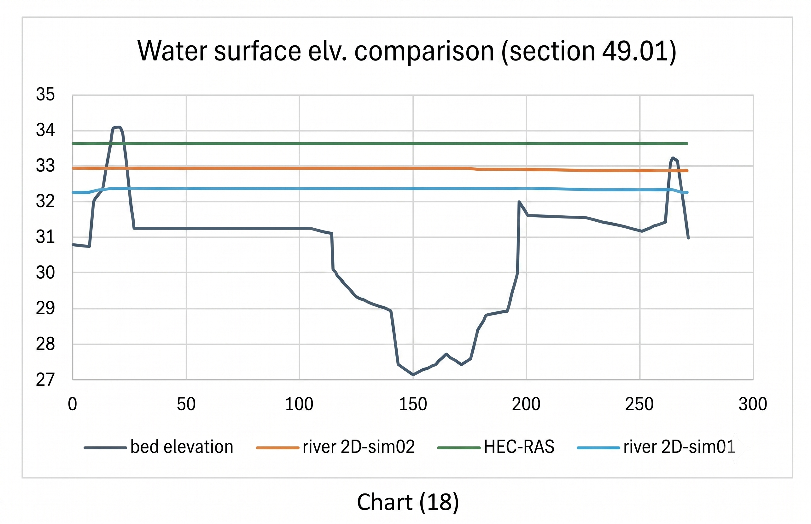

# River Hydraulics for Flood Risk Evaluation

## Case Study
14 km reach of the **Oglio River** (Lombardy, Italy) between Ostiano and Canneto sull'Oglio

**1D Steady flow**
- Completed geometry by modelling bridges and weir from surveyed cross-sections
- Selected Manning's coefficients from USGS reference tables, validated against aerial photos, sensitivity tested with min/normal/max values
- Tested all four combinations of normal/critical depth at upstream and downstream ends
- Identified sections where HEC-RAS incorrectly flooded dry areas and defined levees properly

**1D Unsteady flow**
- Used design hydrograph for T = 20 years (peak Q = 450 m³/s) as upstream boundary condition
- Performed sensitivity analyses for Manning's, levees, spatial discretization and time step
- Compared results to 1D steady at equivalent discharge

**2D modelling**
- Performed two simulations with different floodplain configurations
- Compared water surface and velocity profiles against 1D results at two cross-sections

## Preview

